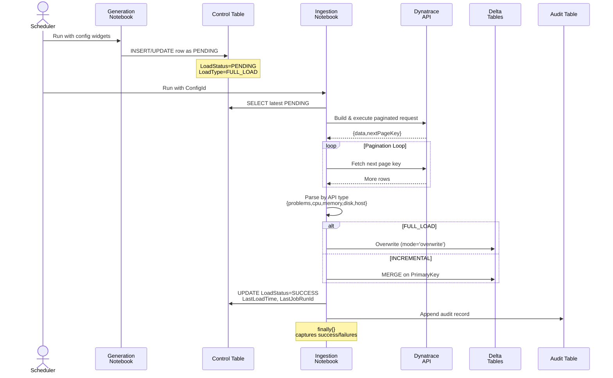

# 🚀 Generic REST API Ingestion Framework

### Enterprise-Grade Data Pipeline | Databricks + Delta Lake (API-Agnostic)

[](https://www.python.org/)
[](https://databricks.com)
[](https://delta.io)
[](https://restfulapi.net/)
[](LICENSE)

A **production-grade, metadata-driven ingestion framework** that transforms any REST API into enterprise-ready Delta Lake tables. Built for scalability, fault tolerance, and operational transparency. Works with any API: SaaS platforms, internal services, data vendors, or custom endpoints.

---

## 🎯 Quick Overview

```
┌─────────────────────────────────────────────────────────────┐
│   Metadata-Driven State Machine                             │
│   ┌──────────────┐  ┌──────────────┐  ┌──────────────┐      │
│   │   PENDING    │→ │   RUNNING    │→ │   SUCCESS    │      │
│   └──────────────┘  └──────────────┘  └──────────────┘      │
│          ↑                                      ↓             │
│          └──────────  FAILED RETRY ────────────┘             │
│                                                              │
│  Auto-advances FULL_LOAD → INCREMENTAL                      │
│  Manages windows, pagination, deduplication                │
└─────────────────────────────────────────────────────────────┘
```

**Core Capabilities:**
- 🔄 Control-plane driven ingestion with state machine (`PENDING → SUCCESS/FAILED`)
- 📦 Bootstrap + incremental loading in single recipe
- 🎯 API-aware parsing (pluggable parsers for any JSON response shape)
- ⚡ Delta upserts (overwrite for full-load, MERGE for incremental)
- 🔍 Centralized audit logging & observability

---

## 🏗️ The Problem We Solve

Enterprise API ingestion faces critical challenges:

| Challenge | Impact | Solution |
|-----------|---------|----------|
| **Failed Runs** | Can't safely retry without data corruption | State machine with idempotent transitions |
| **Historical to Steady-State** | Manual switching between batch & incremental | Auto-advance from `FULL_LOAD` → `INCREMENTAL` |
| **API Shape Variance** | Different APIs return different JSON structures | Single orchestrator with pluggable parsers |
| **Visibility Gap** | No audit trail for compliance/debugging | Immutable audit table with full telemetry |
| **Pagination Complexity** | Easy to miss records or hit rate limits | Automated window-splitting + pagination tracking |

---

## 🏛️ Architecture & Design Pattern

### High-Level Data Flow

```mermaid
graph LR
    A["Databricks<br/>Scheduler"] -->|Trigger| B["Generation<br/>Notebook"]
    B -->|Insert PENDING| C["Control Table<br/>metadata.api_control"]
    A -->|Trigger| D["Ingestion<br/>Notebook"]
    D -->|Read PENDING| C
    D -->|Fetch<br/>w/ Pagination| E["REST API<br/>Endpoint"]
    E -->|JSON<br/>payload| D
    D -->|Parse<br/>& Denormalize| F["Transform<br/>Engine"]
    F -->|FULL: Overwrite<br/>INC: MERGE| G["Target Delta<br/>Tables"]
    D -->|Audit Trail| H["Audit Table<br/>metadata.api_audit"]
    C -->|Update Status| C
    style B fill:#FF813F,color:#fff
    style D fill:#FF813F,color:#fff
    style E fill:#4CAF50,color:#fff
    style G fill:#00A4EF,color:#fff


### State Machine & Lifecycle

The framework implements a deterministic state engine for reliability:

```mermaid
stateDiagram-v2
    [*] --> FULL_PENDING: ConfigId creation
    
    FULL_PENDING --> FULL_SUCCESS: Data pulled & written
    FULL_PENDING --> FULL_FAILED: API/parsing error
    FULL_FAILED --> FULL_PENDING: Manual retry
    
    FULL_SUCCESS --> INC_PENDING: DeltaColumn=true
    FULL_SUCCESS --> FULL_PENDING: DeltaColumn=false / Refresh
    
    INC_PENDING --> INC_SUCCESS: Incremental window loaded
    INC_PENDING --> INC_FAILED: API timeout / merge error
    INC_SUCCESS --> INC_PENDING: Next rolling window
    INC_FAILED --> INC_PENDING: Auto-retry with same window
```

**Key Insights:**
- ✅ Symmetric retry paths prevent stuck jobs
- ✅ Explicit state prevents double-loading
- ✅ DeltaColumn flag controls full vs. incremental behavior



---

## 🛠️ Technical Implementation

## 📁 Repository Structure

```
API-Ingestion/
├── 📄 API_Control_Generation.py
│   ├─ Widget-based config ingestion (APIName, Endpoint, DataRange, etc.)
│   ├─ Control table CRUD + audit table schema creation
│   ├─ State machine transitions (FULL_LOAD → INCREMENTAL)
│   └─ Deterministic PENDING row insertion
│
├── 🚀 API_Runtime_Ingestion.py
│   ├─ ConfigId → Control table lookup
│   ├─ Generic REST request builder (any endpoint)
│   ├─ Pagination handler (cursor/offset/page-based)
│   ├─ Pluggable JSON parser (custom logic per API)
│   ├─ Delta writes: FULL overwrite + INCREMENTAL MERGE
│   └─ Try/Finally audit logging (success & error paths)
│
└── 📚 Legacy_Prototypes/
    └─ Experimental approaches (reference only)
```

---

## 🔧 Core Components

### **Component 1️⃣: Control Record Generation**
📄 **File:** `API_Control_Generation.py`

**What it does:**
- Accepts widget parameters from scheduler for any API
- Creates control & audit tables (idempotent with `IF NOT EXISTS`)
- Inserts initial `FULL_LOAD` metadata rows
- Advances runs through state transitions based on prior execution status
- Sets eligible rows to `PENDING` for ingestion notebook pickup

**Key Code Pattern:**
```python
spark.sql(f"""
  UPDATE {control_table}
     SET LoadStatus = 'PENDING'
   WHERE ConfigId = '{config_id}' 
     AND LoadType = 'FULL_LOAD'
     AND LoadStatus = 'FAILED'
""")
```

**Design Win:** Scheduling logic stays simple; notebook state machine handles all sequencing.

---

### **Component 2️⃣: Runtime Ingestion Engine**
🚀 **File:** `API_Runtime_Ingestion.py`

**What it does (production logic):**

1. **Secret Management**
   - Retrieves API credentials/tokens from Databricks secret scope
   - Supports multiple authentication types (Bearer, API-Key, OAuth)
   ```python
   API_CREDENTIALS = {
       "default_api": dbutils.secrets.get(scope=SECRET_SCOPE, key="api-token"),
       "secondary_api": dbutils.secrets.get(scope=SECRET_SCOPE, key="secondary-api-key")
   }
   ```

2. **Control Table State Machine**
   - Reads latest `PENDING` row from control table
   - Validates state & retrieves: endpoint, payload, load type, primary key
   - Coordinates state transitions (`PENDING` → `SUCCESS`/`FAILED`)
   ```python
   def update_control_table(config_id):
       # Fetch latest control record
       latest = spark.table(control_table)\
           .filter(col("ConfigId") == config_id)\
           .orderBy(col("LastUpdatedTime").desc())\
           .limit(1).first()
       
       # Apply state machine logic
       if load_type == "FULL_LOAD" and load_status == "FAILED":
           spark.sql(f"UPDATE ... SET LoadStatus = 'PENDING'")
   ```

3. **Generic HTTP Request Builder**
   - Constructs requests for any REST endpoint
   - Supports GET/POST methods
   - Handles custom headers & authentication
   ```python
   def build_api_request(endpoint, auth_headers, query_params=None):
       url = endpoint
       if query_params:
           url += "?" + "&".join([f"{k}={v}" for k, v in query_params.items()])
       return requests.get(url, headers=auth_headers, timeout=60)
   ```

4. **HTTP & Pagination Handler**
   - Uses `requests` library with timeout & retry logic
   - Supports multiple pagination styles: cursor-based, offset, page number
   - Handles oversized result sets systematically
   ```python
   response = requests.get(url, headers=auth_headers, timeout=60)
   all_data = response.json()
   # Detect pagination type and iterate
   while next_page_key or next_page_number:
       next_url = build_next_page_url(url, next_page_key)
       response = requests.get(next_url, headers=auth_headers)
       all_data = merge_results(all_data, response.json())
   ```

5. **Pluggable JSON Parser**
   ```python
   def parse_response(response_json, parser_config):
       """
       Flexible parser based on API response structure.
       Each API provides custom logic (path to data, field mapping, etc.)
       """
       data_path = parser_config.get("data_path")  # e.g., "results[0].items"
       rows = extract_nested_data(response_json, data_path)
       
       # Apply optional transformations
       if parser_config.get("flatten"):
           rows = flatten_nested_structure(rows)
       
       return spark.createDataFrame(rows)
   ```

6. **Delta Lake Writes**
   - **Full Load:** Overwrite entire target table
   - **Incremental:** MERGE on configured primary key (deduplication)
   ```python
   if load_type == "FULL_LOAD":
       rows_df.write.format("delta").mode("overwrite")\
           .saveAsTable(target_table)
   else:  # INCREMENTAL
       rows_df.write.format("delta").mode("append")\
           .option("mergeSchema", "true")\
           .saveAsTable(target_table)
   ```

7. **Time Window Splitting** (Handles API limits)
   - Configurable by API (monthly, weekly, daily, hourly windows)
   - Prevents timeouts on large historical ranges
   ```python
   def build_windows(api_config, start_time, end_time):
       """Generate time windows based on API-specific rules."""
       window_size = api_config.get("window_days", 7)
       return split_date_range_by_days(start_time, end_time, chunk_days=window_size)
   ```

8. **Audit Logging** (try/finally block)
   - Captures execution time, row counts, error messages
   - Appends immutable record (no updates)
   - Enables debugging & SLA tracking
   ```python
   try:
       # ... ingestion logic ...
       spark.sql(f"""
           INSERT INTO {audit_table}
           VALUES ('{config_id}', {source_count}, {target_count}, 'SUCCESS', ...)
       """)
   except Exception as e:
       spark.sql(f"""
           INSERT INTO {audit_table}
           VALUES ('{config_id}', NULL, NULL, 'FAILED', '{str(e)}', ...)
       """)
   ```

---

### **Component 3️⃣: Legacy Reference**
📚 **Folder:** `Legacy_Prototypes/`

Historical prototypes and exploratory logic. Use for reference only; production should use Components 1 & 2.

---

## 🎯 API Coverage & Keying Strategy

The framework is **API-agnostic** and works with any REST endpoint. Configuration determines behavior:

| Config | Endpoint | Response Pattern | Parsing Strategy | Primary Key |
|--------|----------|------------------|------------------|-------------|
| Your API #1 | `https://api.service.com/v1/data` | `{results: [...]}` | Extract nested array | Configured per contract |
| Your API #2 | `https://service.io/api/entities` | `{entities: [{items: [...]}]}` | Flatten nested structure | Configured per contract |
| Your API #3 | `https://data-provider.com/export` | `[{...}, {...}]` | Direct array | Configured per contract |

**Each API defines:**
- ✅ REST endpoint URL
- ✅ Authentication method (Bearer token, API key, OAuth, etc.)
- ✅ Query/payload parameters
- ✅ Response data path (where results live in JSON)
- ✅ Primary key fields for deduplication
- ✅ Time window strategy (if applicable)

---

## 📊 Metadata Model & Schema Design

### Control Table: `metadata.api_control_table`

**Purpose:** Source of truth for ingestion state, scheduling, and load metadata for any API.

```python
# Schema (API-agnostic)
CREATE TABLE metadata.api_control_table (
    IndexNo              BIGINT GENERATED ALWAYS AS IDENTITY,  # Auto-incrementing row ID
    ConfigId             STRING  NOT NULL,                      # Unique load configuration
    APIName              STRING  NOT NULL,                      # User-defined API identifier
    APIEndpoint          STRING,                                # Full REST endpoint URL
    LoadType             STRING  NOT NULL,                      # FULL_LOAD | INCREMENTAL
    LoadStartTime        STRING,                                # ISO-8601 UTC timestamp
    LoadEndTime          STRING,                                # ISO-8601 UTC timestamp
    RequestPayload       STRING,                                # JSON query params or POST body
    AuthMethod           STRING,                                # bearer|apikey|oauth|basic
    LastLoadTime         STRING,                                # Last successful ingestion window end
    TargetCatalog        STRING  NOT NULL,                      # Databricks catalog
    TargetSchema         STRING  NOT NULL,                      # Databricks schema
    TargetTable          STRING  NOT NULL,                      # Table name
    PrimaryColumn        STRING,                                # Deduplication key(s)
    DeltaColumn          STRING,                                # true → auto FULL→INC transition
    TriggerScheduleTime  STRING  NOT NULL,                      # Cron/schedule string
    TriggerFrequency     STRING  NOT NULL,                      # daily|hourly|manual
    LoadStatus           STRING  NOT NULL,                      # PENDING|SUCCESS|FAILED
    LastJobRunId         STRING,                                # Databricks job run reference
    LastUpdatedTime      STRING  NOT NULL,                      # Audit timestamp
    PRIMARY KEY (ConfigId, LoadType, LastUpdatedTime)
) USING DELTA
TBLPROPERTIES ('delta.autoOptimize.autoCompact' = 'true');
```

**Key Design Decisions:**
- ✅ `GENERATED ALWAYS AS IDENTITY` for reliable ordering
- ✅ Composite primary key prevents duplicates across state transitions
- ✅ `RequestPayload` is JSON string → flexible for any API
- ✅ Auto-compaction for write efficiency
- ✅ Deterministic schema enables easy schema evolution

---

### Audit Table: `metadata.api_audit_table`

**Purpose:** Immutable append-only log for operational observability, compliance, and debugging—works with any API.

```python
# Schema (API-agnostic)
CREATE TABLE metadata.api_audit_table (
    ConfigId              STRING    NOT NULL,        # Load identifier
    APIName               STRING    NOT NULL,        # Source API
    APIEndpoint           STRING    NOT NULL,        # Endpoint called
    LoadType              STRING    NOT NULL,        # FULL or INCREMENTAL
    TargetCatalog         STRING    NOT NULL,        # Destination catalog
    TargetSchema          STRING    NOT NULL,        # Destination schema
    TargetTable           STRING    NOT NULL,        # Destination table
    SourceRowCount        BIGINT,                    # Rows from API
    TargetRowCount        BIGINT,                    # Rows written to Delta
    TargetTotalRowCount   BIGINT,                    # Total in table post-load
    RunId                 STRING,                    # Databricks job run ID
    LoadStatus            STRING,                    # SUCCESS | FAILED | PARTIAL
    ErrorMessage          STRING,                    # Exception/error detail (if failed)
    LoadStartTime         STRING,                    # Ingestion start (UTC)
    LoadEndTime           STRING,                    # Ingestion end (UTC)
    RunDuration           STRING,                    # HH:MM:SS elapsed
    LoggedAt              STRING    NOT NULL,        # Record insertion time
    LoadedBy              STRING                     # User/service principal
) USING DELTA;
```

**Audit Benefits:**
- 📝 Complete execution history (zero updates, all appends)
- 📈 Dashboarding: row trends, error rates, duration SLAs
- 🔍 Root cause analysis: compare successful vs. failed runs
- ✅ Compliance: immutable proof of data lineage

---

## ⚙️ Advanced Features

### 1️⃣ Windowing & Pagination Strategy

The framework automatically handles API limits through intelligent window splitting:

```
API Request Size Policy
├─ Heavy Data APIs:      Split by MONTH (avoid timeouts)
├─ Medium Data APIs:     Split by WEEK (balanced)
├─ Light Data APIs:      Split by DAY (or full range)
└─ Cursor Pagination:    Automatic page iteration
```

**Implementation:**
```python
def build_windows(api_config, start_time, end_time):
    """Generate time windows respecting API limits."""
    window_strategy = api_config.get("window_strategy", "weekly")
    
    if window_strategy == "monthly":
        return split_date_range_by_month(start_time, end_time)
    elif window_strategy == "weekly":
        return split_date_range_by_days(start_time, end_time, chunk_days=7)
    elif window_strategy == "daily":
        return split_date_range_by_days(start_time, end_time, chunk_days=1)
    else:
        return [(start_time, end_time)]  # Single request
```

### 2️⃣ Pagination with Cursor/Offset Tracking

Handles multiple pagination styles automatically:

```python
def fetch_with_pagination(url, headers, pagination_style="cursor"):
    """
    Iteratively fetch all pages using configured pagination method.
    Supports: cursor-based, offset-based, page-number
    """
    all_records = []
    page_count = 0
    
    if pagination_style == "cursor":
        next_cursor = None
        while True:
            # Append cursor to URL if exists
            current_url = url
            if next_cursor:
                current_url += f"?cursor={quote_plus(next_cursor)}"
            
            response = requests.get(current_url, headers=headers, timeout=60)
            response.raise_for_status()
            data = response.json()
            
            # Extract records (flexible data extraction)
            records = extract_data(data, data_path)
            all_records.extend(records)
            
            # Check for next page
            next_cursor = data.get("nextCursor")
            if not next_cursor:
                break
            page_count += 1
            
    elif pagination_style == "offset":
        offset = 0
        limit = api_config.get("page_size", 1000)
        while True:
            current_url = f"{url}?offset={offset}&limit={limit}"
            response = requests.get(current_url, headers=headers, timeout=60)
            data = response.json()
            
            records = extract_data(data, data_path)
            if not records:
                break
            
            all_records.extend(records)
            offset += limit
            page_count += 1
    
    print(f"Fetched {len(all_records)} records across {page_count} pages")
    return all_records
```

### 3️⃣ Smart Merge for Incremental Loads

Uses Delta Lake's MERGE operation for efficient incremental processing:

```python
def incremental_upsert(rows_df, target_table, primary_key_cols):
    """MERGE new data into target, handling duplicates."""
    rows_df.createOrReplaceTempView("staging")
    
    merge_sql = f"""
    MERGE INTO {target_table} AS target
    USING staging
    ON {' AND '.join([f'target.{col} = staging.{col}' for col in primary_key_cols])}
    WHEN MATCHED THEN
        UPDATE SET *
    WHEN NOT MATCHED THEN
        INSERT *
    """
    
    spark.sql(merge_sql)
    print(f"Merged {rows_df.count()} rows into {target_table}")
```

### 4️⃣ Secret Management

```python
# Retrieves credentials securely from Databricks secret scope
API_CREDENTIALS = {
    "api_token": dbutils.secrets.get(
        scope="my_secrets",
        key="api-bearer-token"
    ),
    "api_key": dbutils.secrets.get(
        scope="my_secrets",
        key="api-key"
    )
}

# Usage in requests (flexible auth)
def build_auth_headers(credential_type, credential_value):
    if credential_type == "bearer":
        return {"Authorization": f"Bearer {credential_value}"}
    elif credential_type == "apikey":
        return {"X-API-Key": credential_value}
    elif credential_type == "basic":
        return {"Authorization": f"Basic {credential_value}"}
    return {}
```

---

## 🎓 Skills Demonstrated

This framework showcases enterprise-grade data engineering expertise:

| Skill | Evidence |
|-------|----------|
| **REST API Integration** | Generic HTTP client supporting any endpoint + multiple auth methods |
| **Databricks/Spark** | Delta Lake, widget-based parameterization, Try/Finally audit logging |
| **State Machines** | metadata-driven state transitions (FULL_LOAD → INCREMENTAL) with retry logic |
| **Pagination Handling** | Cursor-based, offset, page-number support + automatic pagination |
| **JSON Parsing** | Pluggable parsers for arbitrary response structures |
| **Error Handling** | Idempotent state transitions, granular audit trails, partial failure recovery |
| **SQL & Data Modeling** | Control/audit table design, MERGE operations, schema validation |
| **Secrets Management** | Secure credential retrieval, multiple auth method support |
| **Production Readiness** | Monitoring, observability, operational troubleshooting guides |
| **Scalability** | Window splitting, efficient pagination, Delta Lake optimization |

---

## 🚀 Quick Start Guide

### Prerequisites Checklist

```
✓ Databricks workspace (Unity Catalog enabled recommended)
✓ Spark + Python 3.9+ runtime
✓ Delta format support (default in Databricks)
✓ Secret scope with API credentials (create one for your API)
✓ Target metastore with catalog/schema created
✓ Access to your REST API endpoint
```

### 📋 Configuration Parameters (Generic)

The framework uses **widget-driven parameterization**. When running Generation notebook, provide:

| Parameter | Type | Example | Notes |
|-----------|------|---------|-------|
| `ConfigID` | string | `api_users_daily` | Unique load identifier |
| `APIName` | string | `ServiceAPI` | User-friendly API name |
| `APIEndpoint` | string | `https://api.service.com/v1/users` | Full REST endpoint URL |
| `LoadStartTime` | ISO-8601 | `2024-01-01T00:00:00Z` | Historical range start |
| `LoadEndTime` | ISO-8601 | `2024-01-31T23:59:59Z` | Historical range end |
| `RequestPayload` | JSON | `{"filter":"active"}` | Query params or POST body |
| `AuthMethod` | string | `bearer` \| `apikey` | Authentication type |
| `AuthToken` | string | (via secrets) | Retrieved from Databricks secrets |
| `DataPath` | string | `results[]` or `data.items[]` | Path to data in JSON response |
| `TargetCatalog` | string | `raw_data` | Databricks catalog |
| `TargetSchema` | string | `api_ingestion` | Databricks schema |
| `TargetTable` | string | `tbl_api_users` | Output table name |
| `PrimaryColumn` | string | `user_id` or `id,timestamp` | Deduplication key |
| `delta_col` | boolean | `true` \| `false` | Auto-transition to INCREMENTAL? |
| `PaginationStyle` | string | `cursor` \| `offset` \| `page` | How the API pages results |
| `WindowStrategy` | string | `daily` \| `weekly` \| `monthly` | Time window size (if applicable) |
| `trigger_time` | string | `02:00` | Scheduled run time (HH:MM) |
| `trigger_freq` | string | `daily` \| `hourly` | Execution frequency |

### Step 1️⃣: Initialize Configuration

```python
# In Databricks, create a new notebook cell and run:
# (Or use UI to pass parameters)
dbutils.widgets.text("ConfigID", "api_users_daily", "ConfigId")
dbutils.widgets.text("APIName", "ServiceAPI", "APIName")
dbutils.widgets.text("APIEndpoint", "https://api.service.com/v1/users", "API URL")
dbutils.widgets.text("LoadStartTime", "2024-01-01T00:00:00Z", "Start")
dbutils.widgets.text("LoadEndTime", "2024-01-31T23:59:59Z", "End")
dbutils.widgets.text("RequestPayload", '{"status":"active"}', "Query params (JSON)")
dbutils.widgets.text("AuthMethod", "bearer", "Auth type")
dbutils.widgets.text("DataPath", "results[]", "Path to data in response")
dbutils.widgets.text("TargetCatalog", "raw_data", "Catalog")
dbutils.widgets.text("TargetSchema", "external_apis", "Schema")
dbutils.widgets.text("TargetTable", "tbl_users", "Target Table")
dbutils.widgets.text("PrimaryCol", "user_id", "Primary Key")
dbutils.widgets.text("delta_col", "true", "Delta Column")
dbutils.widgets.text("PaginationStyle", "cursor", "Pagination type")
dbutils.widgets.text("WindowStrategy", "daily", "Window size")
dbutils.widgets.text("trigger_time", "02:00", "Trigger Time")
dbutils.widgets.text("trigger_freq", "daily", "Frequency")
```

**Expected Output:**
✅ Control table row inserted with `LoadStatus = PENDING`  
✅ Audit table created (if first run)

### Step 2️⃣: Execute Ingestion Run

Simply run the **Ingestion Notebook** with the `ConfigID`:

```python
# Ingestion job receives:
dbutils.widgets.text("ConfigId", "api_users_daily", "ConfigId")

# Notebook automatically:
# 1. Fetches latest PENDING row from control table
# 2. Builds REST request (with configured pagination loop)
# 3. Extracts data from JSON response using DataPath
# 4. Parses & denormalizes to DataFrame
# 5. Writes to Delta (FULL overwrite or INCREMENTAL merge)
# 6. Updates control table status
# 7. Logs audit record
```

**Expected Output:**
✅ Data in target table (`raw_data.external_apis.tbl_users`)  
✅ Control table status: `SUCCESS`  
✅ Audit record with row counts & duration

### Step 3️⃣: Validate & Investigate

```sql
-- Check latest run status
SELECT 
    ConfigId, APIName, LoadType, LoadStatus, 
    LastLoadTime, LastJobRunId, LastUpdatedTime
FROM metadata.api_control_table
WHERE ConfigId = 'api_users_daily'
ORDER BY LastUpdatedTime DESC
LIMIT 5;

-- View audit trail
SELECT 
    ConfigId, APIName, SourceRowCount, TargetRowCount, 
    LoadStatus, RunDuration, ErrorMessage, LoggedAt
FROM metadata.api_audit_table
WHERE ConfigId = 'api_users_daily'
ORDER BY LoggedAt DESC
LIMIT 10;

-- Inspect ingested data
SELECT * FROM raw_data.external_apis.tbl_users LIMIT 100;
```

---

## 🔍 Operating the Framework

### Automation with Databricks Workflows

**Recommended Setup:**
```
Workflow: "API Daily Ingestion"
├─ Task 1: Control Generation
│  ├─ Schedule: Daily @ 1:00 AM
│  ├─ Parameters: (as per Step 1)
│  └─ Timeout: 5 min
├─ Task 2: Ingestion Runtime
│  ├─ Depends on: Task 1 SUCCESS
│  ├─ Parameters: ConfigId=${task1.ConfigID}
│  └─ Timeout: 30 min
└─ Task 3: Validation Query (SQL)
   └─ Depends on: Task 2 SUCCESS
```

### Manual Retry Flow

If a run fails:

1. Examine audit table for error message
2. Verify API is up & ConfigId has `LoadStatus = FAILED`
3. **Simply re-run the Ingestion Notebook** with same ConfigId
   - State machine will detect FAILED → PENDING transition
   - Retry uses same time window (idempotent)
   - Audit records both attempts

---

## 💪 Operational Strengths

✅ **Metadata-Driven Design**
- Configuration lives in control table, not hardcoded
- Easy to modify/add new APIs without code changes
- Audit history tracks every execution

✅ **Deterministic State Machine**
- PENDING → SUCCESS → (INC_PENDING | FULL_PENDING)
- PENDING → FAILED → PENDING (idempotent retry)
- No orphaned/stuck states

✅ **Centralized Observability**
- Control table: source of truth for run status
- Audit table: immutable execution log
- One query shows: what succeeded, what failed, why

✅ **API Agnostic**
- Single orchestrator handles 5+ different Dynatrace APIs
- Pluggable parsers for each response shape
- Easy to add new APIs

✅ **Fault Tolerance & Recovery**
- Failed runs don't corrupt data (FULL: overwrite idempotent, INC: MERGE deduplicates)
- Partial failures captured (e.g., page 1-3 succeed, page 4 fails → retry from page 4)
- Job Run IDs & timestamps enable exact rollback if needed

✅ **Scaling & Performance**
- Delta Lake auto-compaction handles write churn
- Window splitting prevents timeouts on large ranges
- Pagination handled automatically

---

## ⚠️ Known Gaps & Hardening Roadmap

### 1. Secret Exposure Risk (LOW PRIORITY in clean repo)
**Issue:** Hardcoded tokens in legacy notebook history
**Action:** Rotate all tokens; use secret scope exclusively

### 2. SQL String Interpolation (MEDIUM PRIORITY)
**Issue:** `spark.sql(f"... WHERE ConfigId = '{config_id}'")` vulnerable to injection
**Action:** Migrate to `spark.sql()` with bound parameters or DataFrame API
```python
# Current (vulnerable):
spark.sql(f"UPDATE table SET col = '{value}'")

# Better:
df.filter(df.ConfigId == config_id).write.saveAsTable(...)
```

### 3. Timestamp Parsing (LOW PRIORITY)
**Issue:** Some time conversions use string manipulation
**Action:** Standardize on `dateutil.parser.parse()` + explicit UTC

### 4. Test Coverage (HIGH PRIORITY)
**Action:** Add pytest suite
```
tests/
├─ test_url_builders.py          # Validate endpoint construction
├─ test_json_parsers.py          # Validate API response parsing
├─ test_state_machine.py         # Validate control transitions
└─ test_window_splitting.py      # Validate time chunking
```

### 5. Repository Organization (MEDIUM PRIORITY)
**Current:** Mixed production + reference code
**Target.**
```
prod/
├─ generation_notebook.py
└─ ingestion_notebook.py
sandbox/
└─ problems_prototype.py
tests/
└─ ...
```

---

## 🐛 Troubleshooting Guide

| Symptom | Cause | Fix |
|---------|-------|-----|
| **"No matching rows in control table"** | ConfigId not found or not PENDING | Run Generation notebook first; check ConfigId spelling |
| **"Invalid endpoint"** | Malformed URL or incorrect API path | Verify APIEndpoint is complete & accessible; test with curl/Postman |
| **"401 Unauthorized"** | Missing or expired credentials | Verify auth token in secrets; check auth method (bearer/apikey) |
| **"API timeout after 60s"** | Time range too large for single request | Reduce date range; adjust WindowStrategy to smaller chunks |
| **"Duplicate row errors in MERGE"** | Primary key not unique | Verify PrimaryColumn includes all uniqueness constraints (e.g., add timestamp) |
| **"Empty target table, status=SUCCESS"** | API returned no rows for that window | Check: 1) API returns data, 2) DataPath is correct, 3) Time range has data |
| **"JSON parsing failed"** | DataPath doesn't match API response structure | Enable debug logging; print response JSON; adjust DataPath in config |
| **"Control table row stuck in PENDING"** | Ingestion notebook crashed before final status update | Check Databricks job logs; manually retry or force status update |
| **"Authentication header missing"** | AuthMethod not implemented | Verify AuthMethod value (bearer/apikey/basic) and credential format |
| **"Rate limit exceeded"** | Too many API calls in short time | Add delays between requests; reduce WindowStrategy chunk size; request API rate limit allowance |

---

## 🎯 Next Steps & Enhancements

### Short-term (Ready for sprint):
1. **Add data quality checks**
   - Verify row count doesn't drop > 10% from prior run
   - Flag null % by column
   ```python
   df.select([count(when(col(c).isNull(), 1)).alias(f"{c}_null_count") for c in df.columns])
   ```

2. **Build audit dashboard** (Databricks SQL)
   - Success rate trend
   - Average load duration
   - Error distribution
   - SLA tracking (daily run by 3 AM)

3. **Add incremental load validation**
   - Compare row counts between windows
   - Detect unexpected spikes

### Medium-term (Next quarter):
1. **Modularize into Python package**
   ```
   dynatrace_ingestion/
   ├─ api_client.py        (REST calls + pagination)
   ├─ parsers.py           (JSON → DataFrame)
   ├─ state_machine.py     (Control table logic)
   ├─ window_splitter.py   (Time windowing)
   └─ delta_writer.py      (FULL/INCREMENTAL)
   ```

2. **Add CI/CD validation**
   - Lint notebooks before promotion
   - Test parser outputs on sample JSON
   - Validate state transitions

3. **Multi-tenant support**
   - ConfigId → customer mapping
   - Tenant isolation in control/audit tables

### Long-term (Roadmap):
1. **Streaming source**
   - Event Hub → REST API → Delta (real-time data ingestion)
2. **Multi-region failover**
   - ConfigId with region affinity
   - Silent fallback to secondary endpoint
3. **Cost optimization**
   - Reserved capacity calculator
   - Query result caching

---

## 📚 Using with Your API

### API Integration Checklist

To integrate **any REST API** with this framework:

1. **Identify API characteristics:**
   - ✅ Base endpoint URL
   - ✅ Authentication type (Bearer, API Key, Basic, OAuth)
   - ✅ Response format (JSON top-level array vs nested object)
   - ✅ Pagination style (cursor, offset, page number, or none)

2. **Document the response structure:**
   ```json
   // Example: if your API returns:
   {
     "data": [
       {"id": 1, "name": "Record A", "created_at": "2024-01-01"},
       {"id": 2, "name": "Record B", "created_at": "2024-01-02"}
     ],
     "nextCursor": "abc123xyz"
   }
   // Then: DataPath = "data[]"
   //       PaginationStyle = "cursor"
   //       PrimaryColumn = "id"
   ```

3. **Store credentials in Databricks secrets:**
   ```bash
   # In Databricks:
   dbutils.secrets.put(scope="my_secrets", key="your-api-token", value="token-value")
   ```

4. **Configure in Generation notebook** with your parameters (see Quick Start)

5. **Monitor via audit table** for troubleshooting

---

## 📝 License & Contributing

This framework is production-ready but experimental. Use at your own discretion.

**Contributing:**
- Submit fixes via PR with test coverage
- Document new API parsers in this README
- Rotate secrets before committing

---

## 📞 Support & Questions

For issues:
1. Check **Troubleshooting** section above
2. Review audit table for error details
3. Enable debug logging in notebook (add `print()` statements)
4. Check Databricks job logs for full stack traces

---

## ✨ Summary

This framework demonstrates **production-grade data engineering** across:

- 🔌 **Generic REST API Integration** — Works with any REST endpoint (SaaS, internal APIs, webhooks)
- 🚀 **Databricks + Spark** — State machines, Delta MERGE, metadata-driven parameterization
- 🔄 **Fault-Tolerant Workflows** — Idempotent retries, comprehensive audit trails, error recovery
- 📊 **Flexible Data Handling** — Pluggable parsers, any JSON structure, multiple pagination styles
- 🛡️ **Enterprise Best Practices** — Secret management, observability, scalability, compliance

**Ready to ingest any API.** Add your endpoint, define your data path, and let the framework handle the rest.

---

*Last updated: 2026-02-11*
